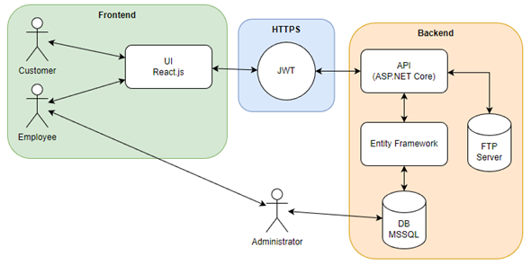
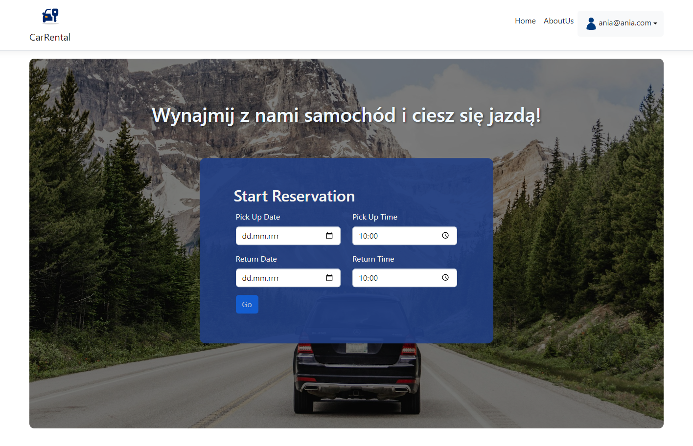
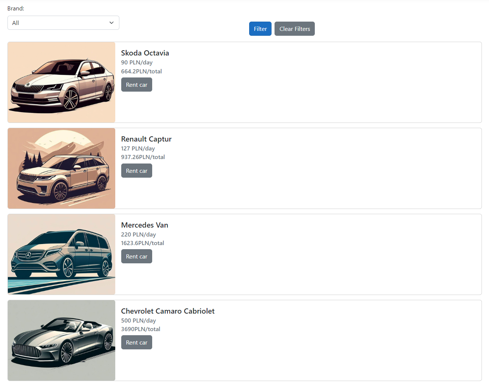
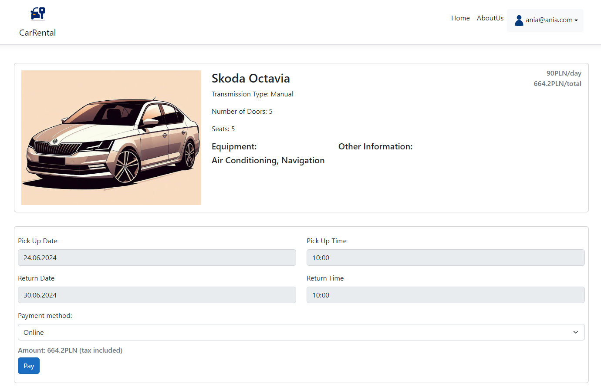
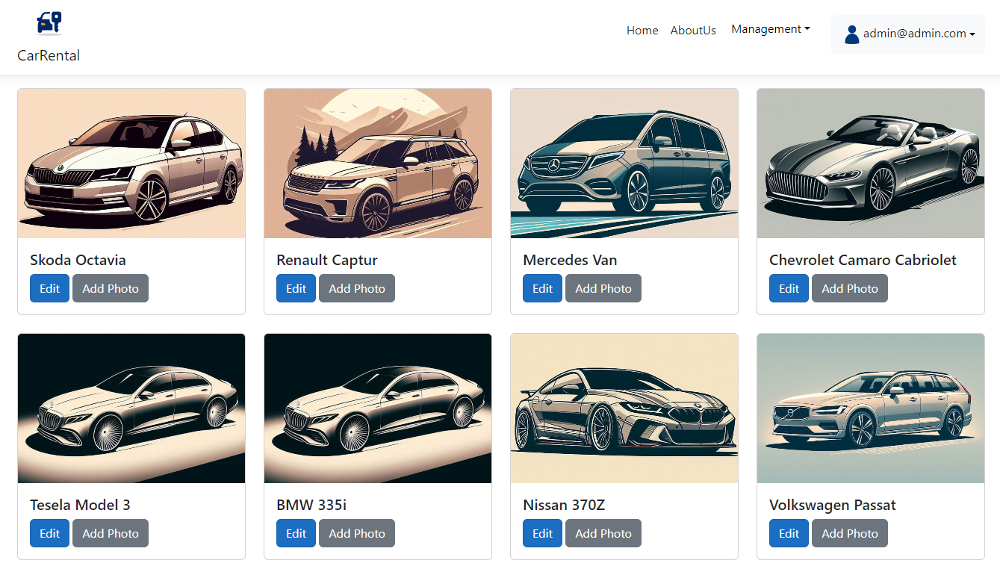
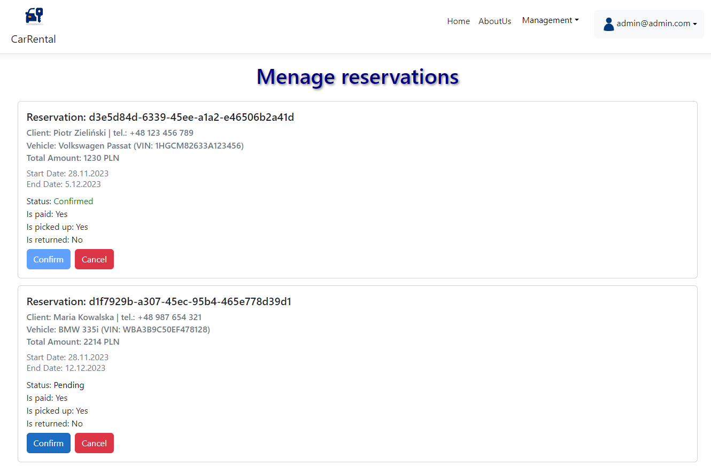

# Car Rental App

The requirements specification (in Polish) can be found in the file [Specyfikacja_Wymagan.pdf](Specyfikacja_Wymagan.pdf). It contains a description of the system architecture, data model, and functional and non-functional requirements.

# Architecture

# Application

## Customer view

Landing page

Vehicles list

Reservation page

## Employee panels

Manage vehicles page

Manage reservations page

# Authors

Michał Mrowiec  
Marcin Kuśnierz
